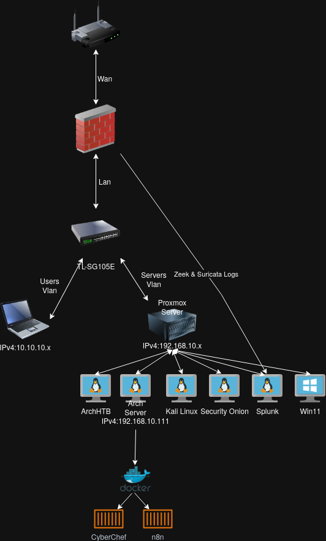

# 🛡️ Home Lab SOC Environment

A personal Security Operations Center (SOC) lab environment built for hands-on blue team training, threat detection, and DFIR practice. This project documents my journey in building a segmented network with enterprise-grade security monitoring capabilities on a home lab budget.

## 📋 Table of Contents

- [Overview](#overview)
- [Architecture](#architecture)
- [Hardware Specifications](#hardware-specifications)
- [Network Design](#network-design)
- [Security Stack](#security-stack)
- [Use Cases & Projects](#use-cases--projects)
- [Challenges & Solutions](#challenges--solutions)
- [Future Improvements](#future-improvements)

## Overview

This home lab simulates a small enterprise network with proper segmentation, traffic monitoring, and log analysis capabilities. The primary goal is to develop practical SOC analyst skills through:

- Real-time network traffic analysis
- Log aggregation and SIEM operations
- Intrusion detection and alerting
- Digital forensics and incident response (DFIR) practice

## Architecture



The environment follows a defense-in-depth approach with network segmentation enforced at the firewall level.

### Traffic Flow

```
ISP Router
    │
    ▼ (WAN)
┌─────────────────────────────────┐
│   pfSense Firewall              │
│   Zeek + Suricata (IDS/NSM)     │
└─────────────────────────────────┘
    │ (LAN - Trunk)
    ▼
┌─────────────────────────────────┐
│      TP-Link TL-SG105E          │
│       (Managed Switch)          │
├────────────────┬────────────────┤
│    VLAN 10     │    VLAN 20     │
│  Users Network │ Servers Network│
│  10.10.10.0/24 │192.168.10.0/24 │
└────────────────┴────────────────┘
                        │
                        ▼
              ┌─────────────────┐
              │ Proxmox Server  │
              │192.168.10.x     │
              ├─────────────────┤
              │ VMs:            │
              │ • Arch Server   │
              │ • Security Onion│
              │ • Splunk        │
              │ • Kali Linux    │
              │ • Arch HTB      │
              │ • Win11         │
              └─────────────────┘
```

## Hardware Specifications

### Proxmox Virtualization Host

| Component | Specification |
|-----------|---------------|
| CPU | Intel Core i5-12500 (12 cores) |
| RAM | 32 GB DDR4 |
| Storage | 1 TB NVMe SSD + 1 TB HDD |
| GPU | Integrated (APU) |

### Network Infrastructure

| Device | Model | Role |
|--------|-------|------|
| Firewall | Repurposed Laptop | pfSense + Zeek + Suricata |
| Switch | TP-Link TL-SG105E | VLAN Management (5 ports) |

## Network Design

### VLAN Segmentation

| VLAN ID | Name | Subnet | Purpose | Switch Ports |
|---------|------|--------|---------|--------------|
| 10 | Users | 10.10.10.0/24 | Personal devices, isolated from servers | 2 |
| 20 | Servers | 192.168.10.0/24 | Lab VMs, security tools, Proxmox | 2 |

### Firewall Rules Philosophy

- **Users VLAN → Servers VLAN**: Blocked by default
- **Servers VLAN → Users VLAN**: Blocked by default  
- **Inter-VLAN routing**: Denied unless explicitly required
- **Outbound**: Allowed with logging for analysis

This segmentation ensures that even if a device on the Users network is compromised, lateral movement to the lab environment is prevented.

## Security Stack

### Virtual Machines (Proxmox)

| VM | OS | Purpose | Status |
|----|----|---------|--------|
| Arch Server | Arch Linux + Docker | CyberChef, n8n, core services | Always On |
| Security Onion | Security Onion | Network security monitoring (Standalone) | On-demand |
| Splunk | Debian | SIEM, log aggregation, alerting | On-demand |
| HTB-Arch | Arch Linux (Custom) | HackTheBox Sherlock challenges, DFIR | On-demand |
| Kali Linux | Kali | Penetration testing, red team simulations | On-demand |
| Win11-Lab | Windows 11 | Malware analysis, Windows forensics | On-demand |

### Docker Containers (Arch Server)

| Container | Purpose |
|-----------|---------|
| CyberChef | Data encoding/decoding, analysis |
| n8n | Workflow automation, future LLM integration |

### Monitoring Pipeline

```
Network Traffic
      │
      ▼
┌─────────────────────────────────────┐
│           pfSense Firewall          │
│  ┌─────────────┐  ┌──────────────┐  │
│  │    Zeek     │  │   Suricata   │  │
│  │ (Metadata)  │  │   (IDS/IPS)  │  │
│  └──────┬──────┘  └──────┬───────┘  │
└─────────┼────────────────┼──────────┘
          │                │
          └───────┬────────┘
                  ▼
           ┌────────────┐
           │   Splunk   │
           │   (SIEM)   │
           └─────┬──────┘
                 │ (Planned)
                 ▼
           ┌────────────┐
           │    n8n     │
           │ + LLM API  │
           │(Automation)│
           └────────────┘
```

**Log Sources:**
- Zeek connection logs, DNS, HTTP, SSL metadata
- Suricata alerts (ET Open ruleset)
- pfSense firewall logs

## Use Cases & Projects

### HackTheBox Sherlock Challenges

Completed DFIR challenges using this lab environment:

| Challenge | Category | Skills Practiced |
|-----------|----------|------------------|
| Brutus | Auth Log Analysis | Linux authentication forensics |
| Meerkat | Network Analysis | PCAP analysis, C2 detection |
| Unit42 | Malware Analysis | Static/dynamic analysis |
| PhishNet | Email Forensics | Phishing email analysis, IOC extraction |
| Campfire-1 | Windows Forensics | Event log analysis |

> 📝 Writeups available in my [DFIR-Writeups repository](https://github.com/f23783/cybersecurity-portfolio/writeups/hackthebox/sherlocks/)

### Detection Validation

- Verified Security Onion detection capabilities using Nmap scans from Users VLAN
- Tested alert generation for reconnaissance activities

## Challenges & Solutions

### USB 2.0 Ethernet Adapter Latency

**Problem:** The laptop repurposed as a pfSense firewall lacks USB 3.0 ports. The external USB Ethernet adapter (required for WAN connection) operates on USB 2.0, causing intermittent connectivity issues and latency spikes.

**Impact:** 
- Occasional packet loss during high-throughput scenarios
- Zeek/Suricata may miss packets during traffic bursts

**Current Workaround:**
- Monitoring for connection drops
- Considering dedicated low-power hardware (e.g., Protectli Vault, used Dell OptiPlex) for future upgrade

**Lessons Learned:**
- Hardware limitations matter in network security
- USB Ethernet adapters are not ideal for firewall deployments
- Plan hardware requirements before building the lab

## Future Improvements

- [ ] Replace pfSense laptop with dedicated mini PC
- [ ] Add dedicated SPAN port for Security Onion
- [ ] Implement Wazuh for endpoint detection (EDR)
- [ ] **LLM-powered log analysis** — Integrate local LLM with n8n for automated log summarization, anomaly detection, and server health monitoring
- [ ] Create attack simulations with Atomic Red Team
- [ ] Add Velociraptor for endpoint forensics
- [ ] Document more HackTheBox Sherlock writeups

## Repository Structure

```
homelab-soc-environment/
├── diagrams/
│   └── network-topology.png
└── configurations/
    ├── pfsense-firewall-rules.md
    └── vlan-setup.md
```

## Skills Demonstrated

- Network segmentation and VLAN configuration
- Firewall rule design and implementation
- IDS/IPS deployment (Suricata)
- Network Security Monitoring (Zeek)
- SIEM administration (Splunk)
- Virtualization (Proxmox)
- Digital Forensics and Incident Response (DFIR)

## Connect

- **GitHub:** [github.com/f23783](https://github.com/f23783)
- **LinkedIn:** [https://www.linkedin.com/in/arda-fidanc%C4%B1-50a0a9305/](https://www.linkedin.com/in/arda-fidanc%C4%B1-50a0a9305/)

---

*This project is part of my journey to becoming a SOC Analyst. Feedback and suggestions are welcome!*
